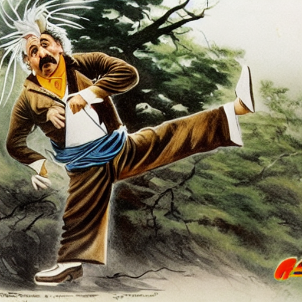

# AI Tools

"einstein practicing kung fu"

Link: https://scribblediffusion.com/scribbles/jgfvg3lbz3hprb2h44syuz4qxy

## Images

### Dall-E

OpenAI: https://openai.com/index/dall-e-2/

Craiyon: https://www.craiyon.com/

Bing Image Creator: https://www.bing.com/images/create/ai-image-generator

### Midjourney

https://www.midjourney.com

### Other Image Creation / Enchancement Tools

Mainly Stable Diffusion.

Brand Studio: https://brandstudio.com/dream

Stable Diffusion: https://stablediffusionweb.com/

Lexica: https://lexica.art/aperture

Hugging Face: https://huggingface.co/spaces/stabilityai/stable-diffusion

Phraser: https://phraser.tech/project/new

Dream: https://dream.ai/create

BlueWillow: https://www.bluewillow.ai/

<!-- Callin Matt? -->

Generated Photos: https://generated.photos/

starryai: https://starryai.com/

ArtBot: https://tinybots.net/artbot

DiffusionBee: https://diffusionbee.com/

Artflow AI: https://app.artflow.ai

ArtBot.ai https://artbot.ai/deep

DeepAI Images: https://deepai.org/

Artbreeder: https://www.artbreeder.com/

Deep Dream Generator: https://deepdreamgenerator.com/

fotor: https://www.fotor.com/

## Drawing

NVIDIA Canvas: https://www.nvidia.com/en-gb/studio/

## Video

VideoCrafter: https://github.com/AILab-CVC/VideoCrafter

Ebsynth: https://ebsynth.com/

RunwayML: https://runwayml.com/

Wonder Studio: https://wonderdynamics.com/

Izotope Neutron: https://www.izotope.com/en/shop/neutron-4/

Movavi Video Editor: https://www.movavi.com/video-editor-plus/

Colourlab AI: https://colourlab.ai/

Descript: https://www.descript.com/

Adobe Premiere Pro: https://www.adobe.com/uk/products/premiere.html

## Design

Microsoft Designer: https://designer.microsoft.com/

Canva: https://www.canva.com/

Adobe Firefly: https://www.adobe.com/uk/products/firefly.html

Looka: https://looka.com

Deep Art Effekte: https://www.deeparteffects.com/

Designs.ai: https://designs.ai/en

Uizard: https://uizard.io/ga

Galileo AI: https://stitch.withgoogle.com/

beautiful.ai: https://www.beautiful.ai/

<!-- Chroma   -->

## Audio & Music

Aiva.io

SoundDraw

Soundful

MuseNet

Ecrett Music

## Text

https://deepai.org/chat

    Jasper 

    Neuroflash 

    Writesonic 

    Frase 

    ClosersCopy 

    Rytr 

    Copy.ai 

    Writecream 

    WordHero 

    GoCopy 

    Neuraltext 

## Misc

Runaway: https://runwayml.com/

Songtell: https://songtell.com/